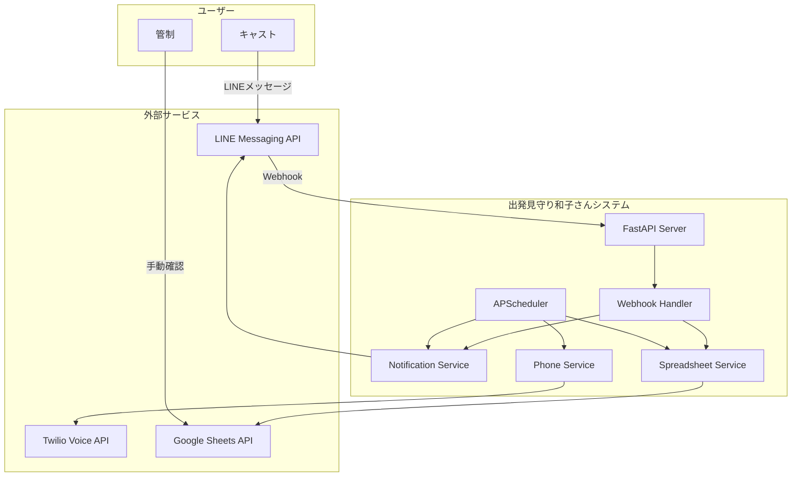
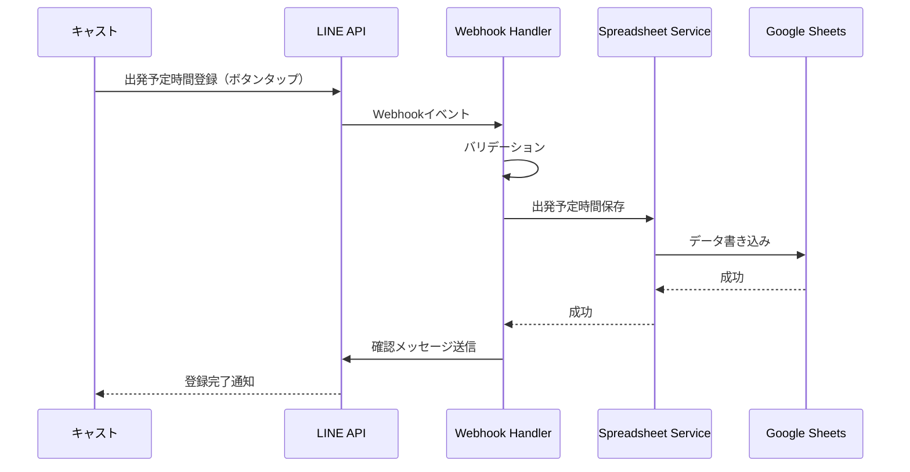
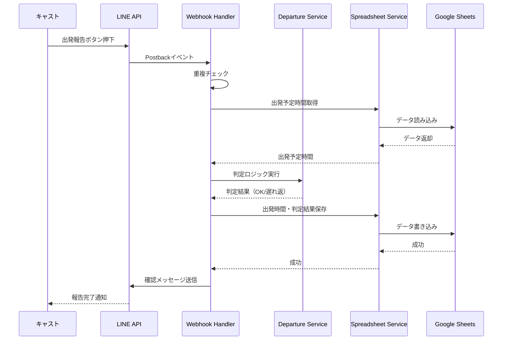
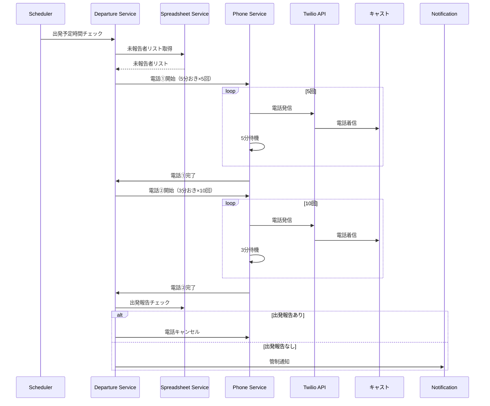
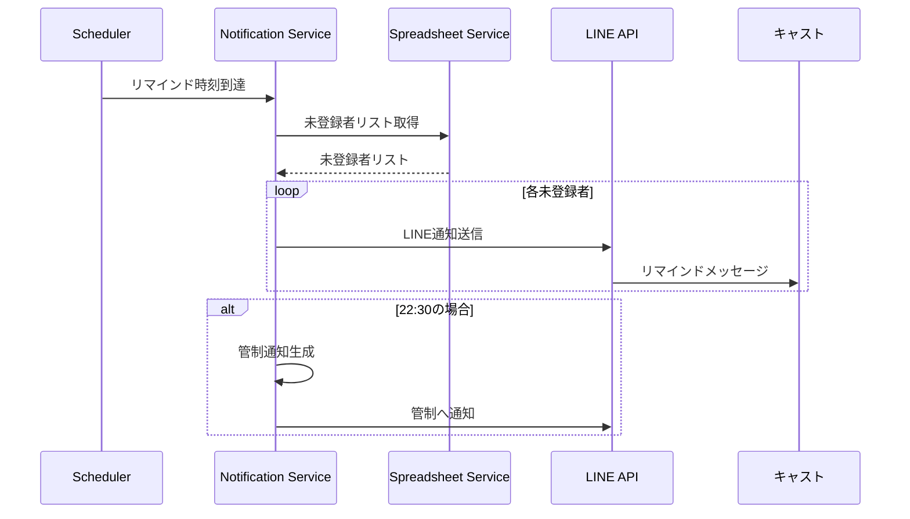
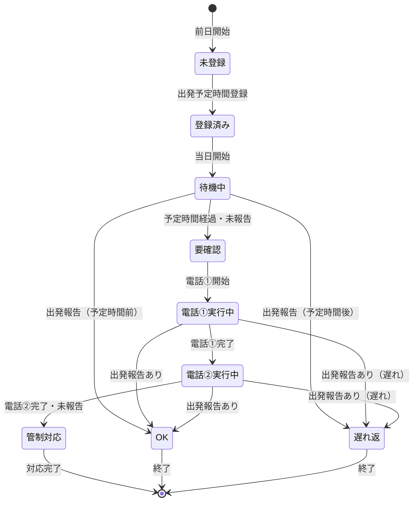
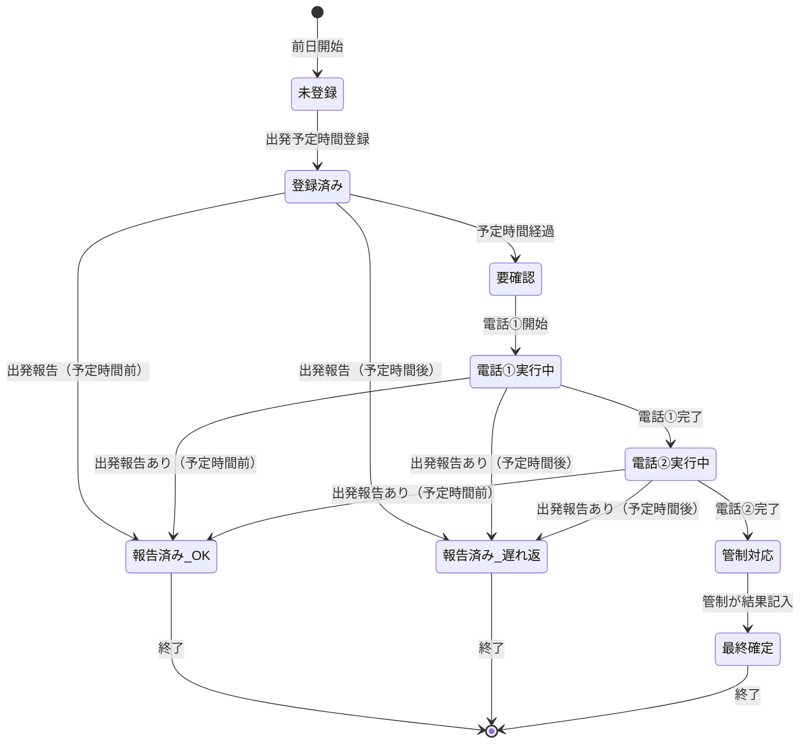
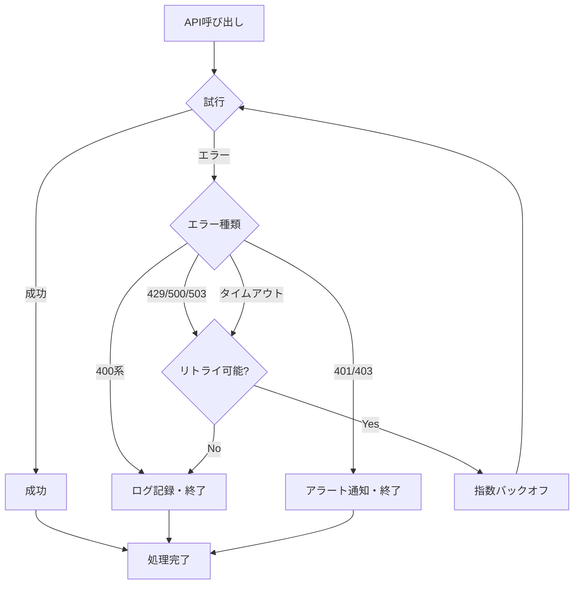
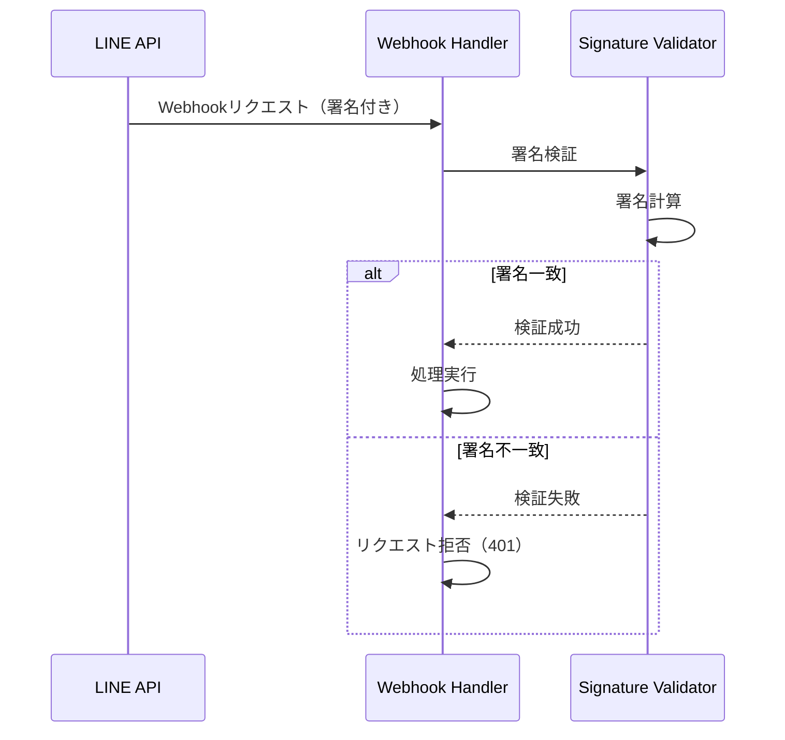

# 出発見守り和子さん｜アーキテクチャ設計書

## 1. システム概要

### 1.1 システム構成図



### 1.2 技術スタック

| レイヤー | 技術 | バージョン |
|---------|------|-----------|
| バックエンド | FastAPI | 0.104.0+ |
| 言語 | Python | 3.11+ |
| スケジューラー | APScheduler | 3.10.0+ |
| HTTPクライアント | httpx | 最新版 |
| データ検証 | Pydantic | 2.0+ |
| ログ | Python logging | 標準ライブラリ |

---

## 2. システムアーキテクチャ

### 2.1 レイヤー構成

```
┌─────────────────────────────────────┐
│   Presentation Layer                 │
│   - LINE Webhook Handler            │
│   - Health Check Endpoint           │
└─────────────────────────────────────┘
                  ↓
┌─────────────────────────────────────┐
│   Application Layer                  │
│   - Notification Service            │
│   - Phone Service                   │
│   - Departure Logic Service         │
│   - Scheduler Service               │
└─────────────────────────────────────┘
                  ↓
┌─────────────────────────────────────┐
│   Domain Layer                       │
│   - Cast Model                      │
│   - DepartureRecord Model           │
│   - Business Logic                  │
└─────────────────────────────────────┘
                  ↓
┌─────────────────────────────────────┐
│   Infrastructure Layer               │
│   - Spreadsheet Service             │
│   - LINE API Client                 │
│   - Twilio API Client               │
│   - Error Handler                   │
│   - Logger                          │
└─────────────────────────────────────┘
```

### 2.2 ディレクトリ構造

```
kazuko_departure_watch/
├── app/
│   ├── __init__.py
│   ├── main.py                 # FastAPIアプリケーションエントリーポイント
│   ├── config.py               # 設定管理
│   ├── models/
│   │   ├── __init__.py
│   │   ├── cast.py            # キャストモデル
│   │   └── departure.py       # 出発管理モデル
│   ├── services/
│   │   ├── __init__.py
│   │   ├── line_service.py    # LINE API連携
│   │   ├── twilio_service.py  # Twilio API連携
│   │   ├── spreadsheet_service.py  # Google Sheets連携
│   │   ├── notification_service.py # 通知サービス
│   │   ├── phone_service.py   # 電話サービス
│   │   └── departure_service.py   # 出発判定サービス
│   ├── handlers/
│   │   ├── __init__.py
│   │   └── webhook_handler.py # LINE Webhook処理
│   ├── schedulers/
│   │   ├── __init__.py
│   │   └── job_scheduler.py   # スケジューラー設定
│   ├── utils/
│   │   ├── __init__.py
│   │   ├── logger.py          # ログ設定
│   │   ├── validators.py      # バリデーション
│   │   └── error_handler.py   # エラーハンドリング
│   └── tests/
│       ├── __init__.py
│       ├── test_models.py
│       ├── test_services.py
│       └── test_handlers.py
├── logs/                       # ログファイル（.gitignore）
├── .env.example               # 環境変数テンプレート
├── .gitignore
├── requirements.txt           # 依存関係
├── README.md
├── SPECIFICATION.md           # 仕様書
└── ARCHITECTURE.md            # 本ドキュメント
```

---

## 3. データフロー

### 3.1 前日出発予定時間登録フロー



### 3.2 当日出発報告フロー



### 3.3 自動電話フロー



### 3.4 前日リマインドフロー



---

## 4. 状態遷移図

### 4.1 キャストの状態遷移



### 4.2 出発レコードの状態遷移



---

## 5. サービス設計

### 5.1 LINE Service

**責務**:
- LINE Messaging APIとの通信
- メッセージ送信
- Webhookイベントの処理

**主要メソッド**:
- `send_message(line_id: str, message: str) -> bool`
- `send_notification(line_id: str, notification: dict) -> bool`
- `verify_signature(body: bytes, signature: str) -> bool`

### 5.2 Twilio Service

**責務**:
- Twilio Voice APIとの通信
- 電話発信
- 電話結果の記録

**主要メソッド**:
- `make_call(phone_number: str, message: str) -> dict`
- `cancel_call(call_sid: str) -> bool`

### 5.3 Spreadsheet Service

**責務**:
- Google Sheets APIとの通信
- データの読み書き
- データのバリデーション

**主要メソッド**:
- `get_casts() -> List[Cast]`
- `get_departure_records(date: date) -> List[DepartureRecord]`
- `update_departure_record(record: DepartureRecord) -> bool`
- `create_departure_record(record: DepartureRecord) -> bool`

### 5.4 Notification Service

**責務**:
- 通知の送信管理
- 未登録者・未報告者の判定
- 管制通知の生成

**主要メソッド**:
- `send_reminder_to_unregistered() -> int`
- `notify_control_unregistered() -> bool`
- `send_emergency_alert(record: DepartureRecord) -> bool`

### 5.5 Phone Service

**責務**:
- 電話発信のスケジューリング
- 電話フローの管理
- 電話結果の記録

**主要メソッド**:
- `start_phone_call_phase1(record: DepartureRecord) -> None`
- `start_phone_call_phase2(record: DepartureRecord) -> None`
- `cancel_phone_calls(record: DepartureRecord) -> None`

### 5.6 Departure Service

**責務**:
- 出発判定ロジック
- 出発時間と予定時間の比較
- 状態遷移の管理

**主要メソッド**:
- `judge_departure(actual_time: datetime, scheduled_time: datetime) -> DepartureStatus`
- `check_departure_status(record: DepartureRecord) -> DepartureStatus`
- `should_start_phone_call(record: DepartureRecord) -> bool`

---

## 6. エラーハンドリング戦略

### 6.1 エラーハンドリングフロー



### 6.2 リトライ戦略

| API | 最大リトライ回数 | バックオフ戦略 |
|-----|----------------|---------------|
| LINE API | 3回 | 指数バックオフ（1s, 2s, 4s） |
| Twilio API | 3回 | 指数バックオフ（1s, 2s, 4s） |
| Google Sheets API | 5回 | 指数バックオフ（1s, 2s, 4s, 8s, 16s） |

---

## 7. スケジューリング設計

### 7.1 スケジューラー構成

```python
# スケジューラー設定例
scheduler = AsyncIOScheduler(timezone='Asia/Tokyo')

# 前日リマインド
scheduler.add_job(
    send_reminder_20,
    'cron',
    hour=20,
    minute=0,
    timezone='Asia/Tokyo'
)

# 当日電話（動的スケジューリング）
# 各キャストの出発予定時間に基づいて動的に生成
```

### 7.2 動的スケジューリング

- 前日24:00に、翌日の出発予定時間を読み込み
- 各キャストの出発予定時間の1分後に電話①をスケジュール
- 電話①完了後、電話②をスケジュール

---

## 8. セキュリティ設計

### 8.1 認証フロー



### 8.2 データ保護

- 環境変数でAPIキーを管理
- ログには個人情報を含めない（ハッシュ化）
- HTTPS通信を必須とする

---

## 9. パフォーマンス要件

### 9.1 応答時間目標

| 処理 | 目標応答時間 |
|------|------------|
| LINE通知送信 | 3秒以内 |
| スプレッドシート読み込み | 5秒以内 |
| スプレッドシート書き込み | 5秒以内 |
| 電話発信 | 10秒以内 |

### 9.2 スループット

- 同時処理可能なLINE通知: 100件/秒
- 同時処理可能な電話発信: 10件/秒

---

## 10. 監視・ログ設計

### 10.1 ログ出力箇所

- API呼び出し（成功・失敗）
- スケジューラー実行
- エラー発生
- 重要な状態遷移

### 10.2 監視メトリクス

- API呼び出し回数
- APIエラー率
- スケジューラー実行成功率
- システム稼働率

---

## 11. デプロイ設計

### 11.1 デプロイ構成

```
本番環境
├── アプリケーションサーバー
│   ├── FastAPIアプリケーション
│   ├── APScheduler
│   └── ログファイル
└── 外部サービス
    ├── LINE Messaging API
    ├── Twilio Voice API
    └── Google Sheets API
```

### 11.2 起動シーケンス

1. 環境変数読み込み
2. ログ設定
3. データベース（スプレッドシート）接続確認
4. スケジューラー初期化
5. FastAPIサーバー起動
6. ヘルスチェック

---

**アーキテクチャ設計書バージョン**: 1.0  
**最終更新日**: 2024-01-15  
**作成者**: システム開発チーム

