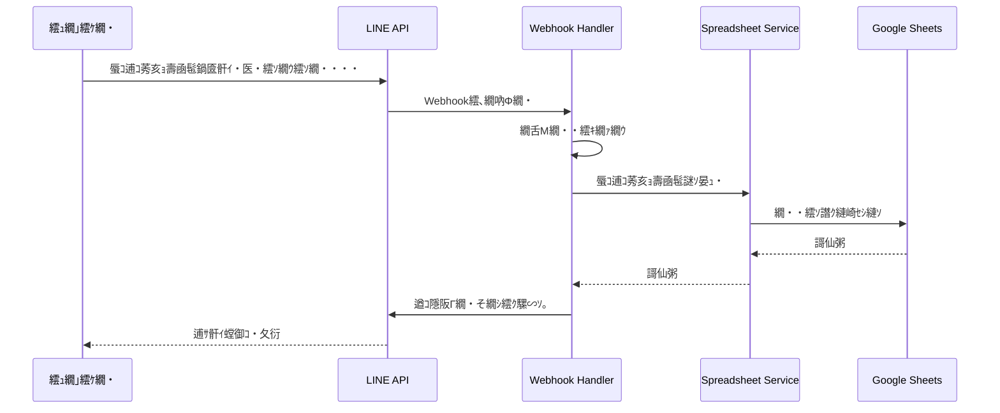
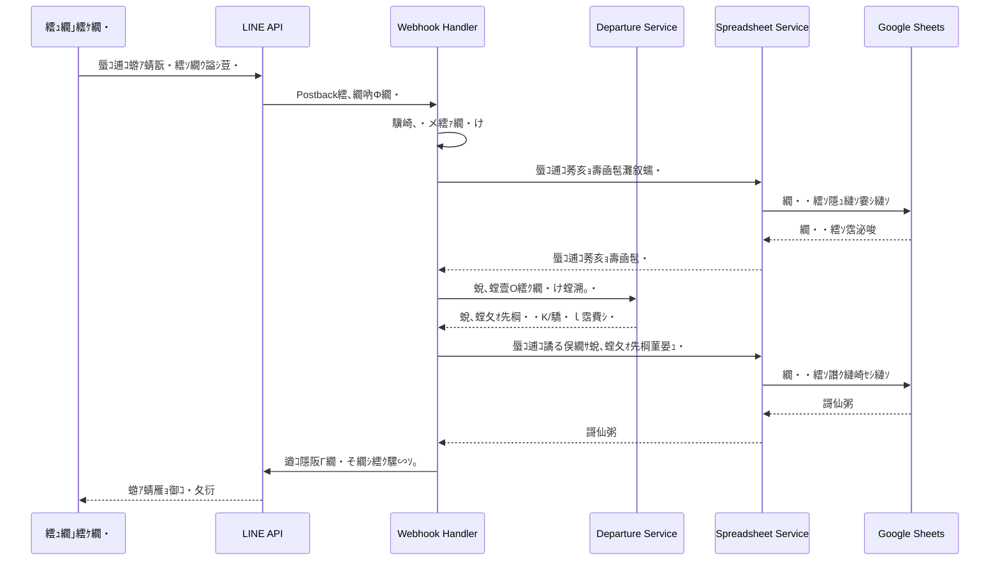
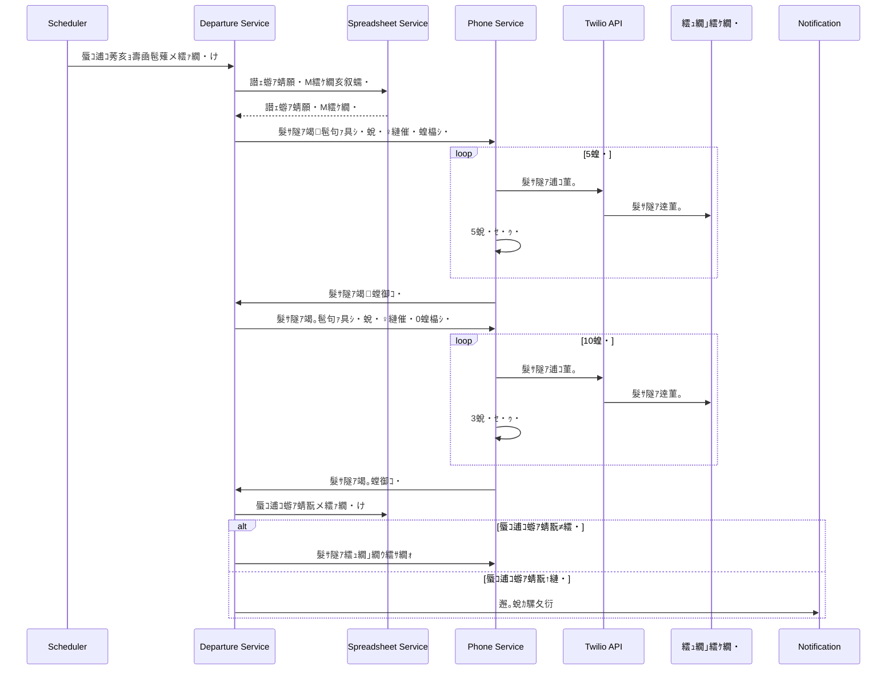
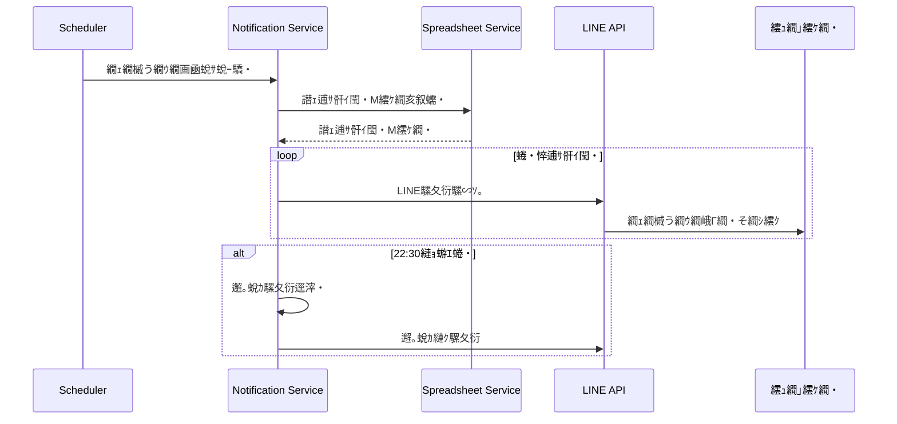
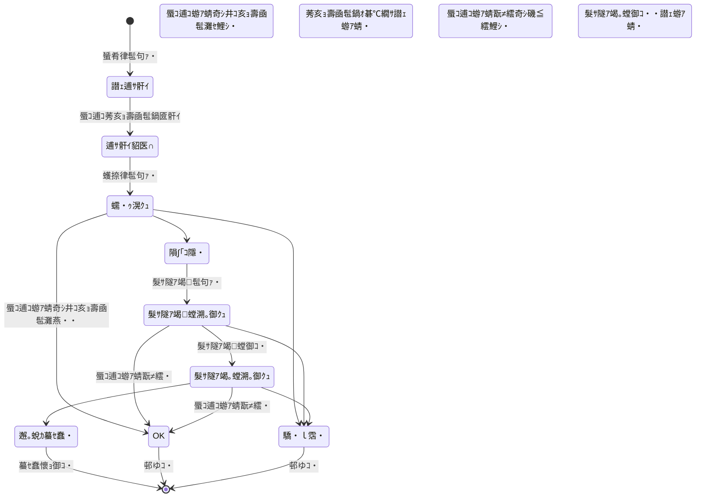
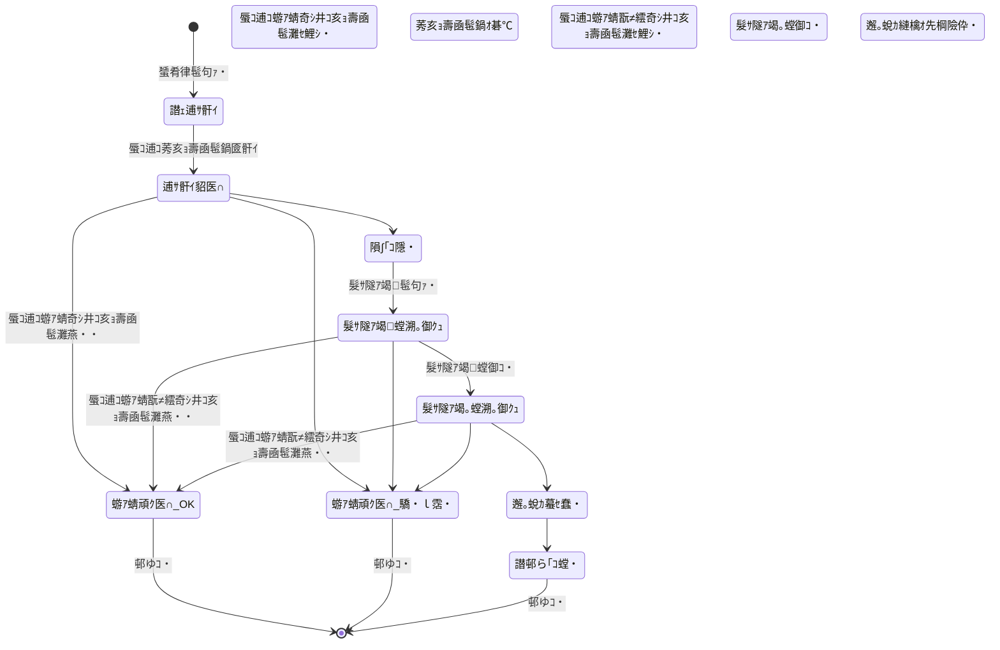
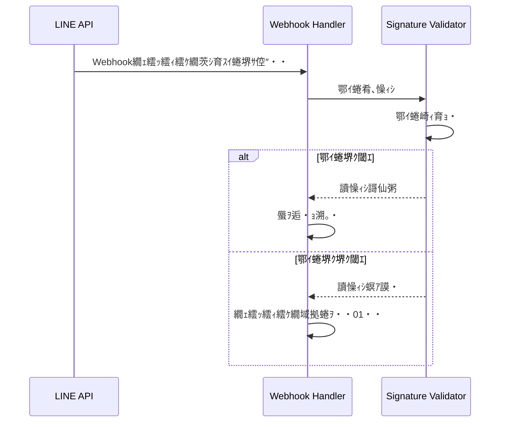

# 蜃ｺ逋ｺ隕句ｮ医ｊ蜥悟ｭ舌＆繧難ｽ懊い繝ｼ繧ｭ繝・け繝√Ε險ｭ險域嶌

## 1. 繧ｷ繧ｹ繝・Β讎りｦ・

### 1.1 繧ｷ繧ｹ繝・Β讒区・蝗ｳ

```mermaid
graph TB
    subgraph External["螟夜Κ繧ｵ繝ｼ繝薙せ"]
        LINE[LINE Messaging API]
        Twilio[Twilio Voice API]
        GoogleSheets[Google Sheets API]
    end
    
    subgraph System["蜃ｺ逋ｺ隕句ｮ医ｊ蜥悟ｭ舌＆繧薙す繧ｹ繝・Β"]
        FastAPI[FastAPI Server]
        Scheduler[APScheduler]
        WebhookHandler[Webhook Handler]
        NotificationService[Notification Service]
        PhoneService[Phone Service]
        SpreadsheetService[Spreadsheet Service]
    end
    
    subgraph Users["繝ｦ繝ｼ繧ｶ繝ｼ"]
        Cast[繧ｭ繝｣繧ｹ繝・
        Control[邂｡蛻ｶ]
    end
    
    Cast -->|LINE繝｡繝・そ繝ｼ繧ｸ| LINE
    LINE -->|Webhook| FastAPI
    FastAPI --> WebhookHandler
    WebhookHandler --> NotificationService
    WebhookHandler --> SpreadsheetService
    NotificationService --> LINE
    PhoneService --> Twilio
    Scheduler --> NotificationService
    Scheduler --> PhoneService
    Scheduler --> SpreadsheetService
    SpreadsheetService --> GoogleSheets
    Control -->|謇句虚遒ｺ隱鋼 GoogleSheets
```

### 1.2 謚€陦薙せ繧ｿ繝・け

| 繝ｬ繧､繝､繝ｼ | 謚€陦・| 繝舌・繧ｸ繝ｧ繝ｳ |
|---------|------|-----------|
| 繝舌ャ繧ｯ繧ｨ繝ｳ繝・| FastAPI | 0.104.0+ |
| 險€隱・| Python | 3.11+ |
| 繧ｹ繧ｱ繧ｸ繝･繝ｼ繝ｩ繝ｼ | APScheduler | 3.10.0+ |
| HTTP繧ｯ繝ｩ繧､繧｢繝ｳ繝・| httpx | 譛€譁ｰ迚・|
| 繝・・繧ｿ讀懆ｨｼ | Pydantic | 2.0+ |
| 繝ｭ繧ｰ | Python logging | 讓呎ｺ悶Λ繧､繝悶Λ繝ｪ |

---

## 2. 繧ｷ繧ｹ繝・Β繧｢繝ｼ繧ｭ繝・け繝√Ε

### 2.1 繝ｬ繧､繝､繝ｼ讒区・

```
笏娯楳笏€笏€笏€笏€笏€笏€笏€笏€笏€笏€笏€笏€笏€笏€笏€笏€笏€笏€笏€笏€笏€笏€笏€笏€笏€笏€笏€笏€笏€笏€笏€笏€笏€笏€笏€笏€笏・
笏・  Presentation Layer                 笏・
笏・  - LINE Webhook Handler            笏・
笏・  - Health Check Endpoint           笏・
笏披楳笏€笏€笏€笏€笏€笏€笏€笏€笏€笏€笏€笏€笏€笏€笏€笏€笏€笏€笏€笏€笏€笏€笏€笏€笏€笏€笏€笏€笏€笏€笏€笏€笏€笏€笏€笏€笏・
                  竊・
笏娯楳笏€笏€笏€笏€笏€笏€笏€笏€笏€笏€笏€笏€笏€笏€笏€笏€笏€笏€笏€笏€笏€笏€笏€笏€笏€笏€笏€笏€笏€笏€笏€笏€笏€笏€笏€笏€笏・
笏・  Application Layer                  笏・
笏・  - Notification Service            笏・
笏・  - Phone Service                   笏・
笏・  - Departure Logic Service         笏・
笏・  - Scheduler Service               笏・
笏披楳笏€笏€笏€笏€笏€笏€笏€笏€笏€笏€笏€笏€笏€笏€笏€笏€笏€笏€笏€笏€笏€笏€笏€笏€笏€笏€笏€笏€笏€笏€笏€笏€笏€笏€笏€笏€笏・
                  竊・
笏娯楳笏€笏€笏€笏€笏€笏€笏€笏€笏€笏€笏€笏€笏€笏€笏€笏€笏€笏€笏€笏€笏€笏€笏€笏€笏€笏€笏€笏€笏€笏€笏€笏€笏€笏€笏€笏€笏・
笏・  Domain Layer                       笏・
笏・  - Cast Model                      笏・
笏・  - DepartureRecord Model           笏・
笏・  - Business Logic                  笏・
笏披楳笏€笏€笏€笏€笏€笏€笏€笏€笏€笏€笏€笏€笏€笏€笏€笏€笏€笏€笏€笏€笏€笏€笏€笏€笏€笏€笏€笏€笏€笏€笏€笏€笏€笏€笏€笏€笏・
                  竊・
笏娯楳笏€笏€笏€笏€笏€笏€笏€笏€笏€笏€笏€笏€笏€笏€笏€笏€笏€笏€笏€笏€笏€笏€笏€笏€笏€笏€笏€笏€笏€笏€笏€笏€笏€笏€笏€笏€笏・
笏・  Infrastructure Layer               笏・
笏・  - Spreadsheet Service             笏・
笏・  - LINE API Client                 笏・
笏・  - Twilio API Client               笏・
笏・  - Error Handler                   笏・
笏・  - Logger                          笏・
笏披楳笏€笏€笏€笏€笏€笏€笏€笏€笏€笏€笏€笏€笏€笏€笏€笏€笏€笏€笏€笏€笏€笏€笏€笏€笏€笏€笏€笏€笏€笏€笏€笏€笏€笏€笏€笏€笏・
```

### 2.2 繝・ぅ繝ｬ繧ｯ繝医Μ讒矩€

```
kazuko_departure_watch/
笏懌楳笏€ app/
笏・  笏懌楳笏€ __init__.py
笏・  笏懌楳笏€ main.py                 # FastAPI繧｢繝励Μ繧ｱ繝ｼ繧ｷ繝ｧ繝ｳ繧ｨ繝ｳ繝医Μ繝ｼ繝昴う繝ｳ繝・
笏・  笏懌楳笏€ config.py               # 險ｭ螳夂ｮ｡逅・
笏・  笏懌楳笏€ models/
笏・  笏・  笏懌楳笏€ __init__.py
笏・  笏・  笏懌楳笏€ cast.py            # 繧ｭ繝｣繧ｹ繝医Δ繝・Ν
笏・  笏・  笏披楳笏€ departure.py       # 蜃ｺ逋ｺ邂｡逅・Δ繝・Ν
笏・  笏懌楳笏€ services/
笏・  笏・  笏懌楳笏€ __init__.py
笏・  笏・  笏懌楳笏€ line_service.py    # LINE API騾｣謳ｺ
笏・  笏・  笏懌楳笏€ twilio_service.py  # Twilio API騾｣謳ｺ
笏・  笏・  笏懌楳笏€ spreadsheet_service.py  # Google Sheets騾｣謳ｺ
笏・  笏・  笏懌楳笏€ notification_service.py # 騾夂衍繧ｵ繝ｼ繝薙せ
笏・  笏・  笏懌楳笏€ phone_service.py   # 髮ｻ隧ｱ繧ｵ繝ｼ繝薙せ
笏・  笏・  笏披楳笏€ departure_service.py   # 蜃ｺ逋ｺ蛻､螳壹し繝ｼ繝薙せ
笏・  笏懌楳笏€ handlers/
笏・  笏・  笏懌楳笏€ __init__.py
笏・  笏・  笏披楳笏€ webhook_handler.py # LINE Webhook蜃ｦ逅・
笏・  笏懌楳笏€ schedulers/
笏・  笏・  笏懌楳笏€ __init__.py
笏・  笏・  笏披楳笏€ job_scheduler.py   # 繧ｹ繧ｱ繧ｸ繝･繝ｼ繝ｩ繝ｼ險ｭ螳・
笏・  笏懌楳笏€ utils/
笏・  笏・  笏懌楳笏€ __init__.py
笏・  笏・  笏懌楳笏€ logger.py          # 繝ｭ繧ｰ險ｭ螳・
笏・  笏・  笏懌楳笏€ validators.py      # 繝舌Μ繝・・繧ｷ繝ｧ繝ｳ
笏・  笏・  笏披楳笏€ error_handler.py   # 繧ｨ繝ｩ繝ｼ繝上Φ繝峨Μ繝ｳ繧ｰ
笏・  笏披楳笏€ tests/
笏・      笏懌楳笏€ __init__.py
笏・      笏懌楳笏€ test_models.py
笏・      笏懌楳笏€ test_services.py
笏・      笏披楳笏€ test_handlers.py
笏懌楳笏€ logs/                       # 繝ｭ繧ｰ繝輔ぃ繧､繝ｫ・・gitignore・・
笏懌楳笏€ .env.example               # 迺ｰ蠅・､画焚繝・Φ繝励Ξ繝ｼ繝・
笏懌楳笏€ .gitignore
笏懌楳笏€ requirements.txt           # 萓晏ｭ倬未菫・
笏懌楳笏€ README.md
笏懌楳笏€ SPECIFICATION.md           # 莉墓ｧ俶嶌
笏披楳笏€ ARCHITECTURE.md            # 譛ｬ繝峨く繝･繝｡繝ｳ繝・
```

---

## 3. 繝・・繧ｿ繝輔Ο繝ｼ

### 3.1 蜑肴律蜃ｺ逋ｺ莠亥ｮ壽凾髢鍋匳骭ｲ繝輔Ο繝ｼ



### 3.2 蠖捺律蜃ｺ逋ｺ蝣ｱ蜻翫ヵ繝ｭ繝ｼ



### 3.3 閾ｪ蜍暮崕隧ｱ繝輔Ο繝ｼ



### 3.4 蜑肴律繝ｪ繝槭う繝ｳ繝峨ヵ繝ｭ繝ｼ



---

## 4. 迥ｶ諷矩・遘ｻ蝗ｳ

### 4.1 繧ｭ繝｣繧ｹ繝医・迥ｶ諷矩・遘ｻ



### 4.2 蜃ｺ逋ｺ繝ｬ繧ｳ繝ｼ繝峨・迥ｶ諷矩・遘ｻ



---

## 5. 繧ｵ繝ｼ繝薙せ險ｭ險・

### 5.1 LINE Service

**雋ｬ蜍・*:
- LINE Messaging API縺ｨ縺ｮ騾壻ｿ｡
- 繝｡繝・そ繝ｼ繧ｸ騾∽ｿ｡
- Webhook繧､繝吶Φ繝医・蜃ｦ逅・

**荳ｻ隕√Γ繧ｽ繝・ラ**:
- `send_message(line_id: str, message: str) -> bool`
- `send_notification(line_id: str, notification: dict) -> bool`
- `verify_signature(body: bytes, signature: str) -> bool`

### 5.2 Twilio Service

**雋ｬ蜍・*:
- Twilio Voice API縺ｨ縺ｮ騾壻ｿ｡
- 髮ｻ隧ｱ逋ｺ菫｡
- 髮ｻ隧ｱ邨先棡縺ｮ險倬鹸

**荳ｻ隕√Γ繧ｽ繝・ラ**:
- `make_call(phone_number: str, message: str) -> dict`
- `cancel_call(call_sid: str) -> bool`

### 5.3 Spreadsheet Service

**雋ｬ蜍・*:
- Google Sheets API縺ｨ縺ｮ騾壻ｿ｡
- 繝・・繧ｿ縺ｮ隱ｭ縺ｿ譖ｸ縺・
- 繝・・繧ｿ縺ｮ繝舌Μ繝・・繧ｷ繝ｧ繝ｳ

**荳ｻ隕√Γ繧ｽ繝・ラ**:
- `get_casts() -> List[Cast]`
- `get_departure_records(date: date) -> List[DepartureRecord]`
- `update_departure_record(record: DepartureRecord) -> bool`
- `create_departure_record(record: DepartureRecord) -> bool`

### 5.4 Notification Service

**雋ｬ蜍・*:
- 騾夂衍縺ｮ騾∽ｿ｡邂｡逅・
- 譛ｪ逋ｻ骭ｲ閠・・譛ｪ蝣ｱ蜻願€・・蛻､螳・
- 邂｡蛻ｶ騾夂衍縺ｮ逕滓・

**荳ｻ隕√Γ繧ｽ繝・ラ**:
- `send_reminder_to_unregistered() -> int`
- `notify_control_unregistered() -> bool`
- `send_emergency_alert(record: DepartureRecord) -> bool`

### 5.5 Phone Service

**雋ｬ蜍・*:
- 髮ｻ隧ｱ逋ｺ菫｡縺ｮ繧ｹ繧ｱ繧ｸ繝･繝ｼ繝ｪ繝ｳ繧ｰ
- 髮ｻ隧ｱ繝輔Ο繝ｼ縺ｮ邂｡逅・
- 髮ｻ隧ｱ邨先棡縺ｮ險倬鹸

**荳ｻ隕√Γ繧ｽ繝・ラ**:
- `start_phone_call_phase1(record: DepartureRecord) -> None`
- `start_phone_call_phase2(record: DepartureRecord) -> None`
- `cancel_phone_calls(record: DepartureRecord) -> None`

### 5.6 Departure Service

**雋ｬ蜍・*:
- 蜃ｺ逋ｺ蛻､螳壹Ο繧ｸ繝・け
- 蜃ｺ逋ｺ譎る俣縺ｨ莠亥ｮ壽凾髢薙・豈碑ｼ・
- 迥ｶ諷矩・遘ｻ縺ｮ邂｡逅・

**荳ｻ隕√Γ繧ｽ繝・ラ**:
- `judge_departure(actual_time: datetime, scheduled_time: datetime) -> DepartureStatus`
- `check_departure_status(record: DepartureRecord) -> DepartureStatus`
- `should_start_phone_call(record: DepartureRecord) -> bool`

---

## 6. 繧ｨ繝ｩ繝ｼ繝上Φ繝峨Μ繝ｳ繧ｰ謌ｦ逡･

### 6.1 繧ｨ繝ｩ繝ｼ繝上Φ繝峨Μ繝ｳ繧ｰ繝輔Ο繝ｼ

```mermaid
graph TB
    Start[API蜻ｼ縺ｳ蜃ｺ縺余 --> Try{隧ｦ陦迎
    Try -->|謌仙粥| Success[謌仙粥]
    Try -->|繧ｨ繝ｩ繝ｼ| CheckType{繧ｨ繝ｩ繝ｼ遞ｮ鬘栲
    CheckType -->|400邉ｻ| LogError[繝ｭ繧ｰ險倬鹸繝ｻ邨ゆｺ・
    CheckType -->|401/403| Alert[繧｢繝ｩ繝ｼ繝磯€夂衍繝ｻ邨ゆｺ・
    CheckType -->|429/500/503| Retry{繝ｪ繝医Λ繧､蜿ｯ閭ｽ?}
    Retry -->|Yes| Backoff[謖・焚繝舌ャ繧ｯ繧ｪ繝評
    Backoff --> Try
    Retry -->|No| LogError
    CheckType -->|繧ｿ繧､繝繧｢繧ｦ繝・ Retry
    Success --> End[蜃ｦ逅・ｮ御ｺ・
    LogError --> End
    Alert --> End
```

### 6.2 繝ｪ繝医Λ繧､謌ｦ逡･

| API | 譛€螟ｧ繝ｪ繝医Λ繧､蝗樊焚 | 繝舌ャ繧ｯ繧ｪ繝墓姶逡･ |
|-----|----------------|---------------|
| LINE API | 3蝗・| 謖・焚繝舌ャ繧ｯ繧ｪ繝包ｼ・s, 2s, 4s・・|
| Twilio API | 3蝗・| 謖・焚繝舌ャ繧ｯ繧ｪ繝包ｼ・s, 2s, 4s・・|
| Google Sheets API | 5蝗・| 謖・焚繝舌ャ繧ｯ繧ｪ繝包ｼ・s, 2s, 4s, 8s, 16s・・|

---

## 7. 繧ｹ繧ｱ繧ｸ繝･繝ｼ繝ｪ繝ｳ繧ｰ險ｭ險・

### 7.1 繧ｹ繧ｱ繧ｸ繝･繝ｼ繝ｩ繝ｼ讒区・

```python
# 繧ｹ繧ｱ繧ｸ繝･繝ｼ繝ｩ繝ｼ險ｭ螳壻ｾ・
scheduler = AsyncIOScheduler(timezone='Asia/Tokyo')

# 蜑肴律繝ｪ繝槭う繝ｳ繝・
scheduler.add_job(
    send_reminder_20,
    'cron',
    hour=20,
    minute=0,
    timezone='Asia/Tokyo'
)

# 蠖捺律髮ｻ隧ｱ・亥虚逧・せ繧ｱ繧ｸ繝･繝ｼ繝ｪ繝ｳ繧ｰ・・
# 蜷・く繝｣繧ｹ繝医・蜃ｺ逋ｺ莠亥ｮ壽凾髢薙↓蝓ｺ縺･縺・※蜍慕噪縺ｫ逕滓・
```

### 7.2 蜍慕噪繧ｹ繧ｱ繧ｸ繝･繝ｼ繝ｪ繝ｳ繧ｰ

- 蜑肴律24:00縺ｫ縲∫ｿ梧律縺ｮ蜃ｺ逋ｺ莠亥ｮ壽凾髢薙ｒ隱ｭ縺ｿ霎ｼ縺ｿ
- 蜷・く繝｣繧ｹ繝医・蜃ｺ逋ｺ莠亥ｮ壽凾髢薙・1蛻・ｾ後↓髮ｻ隧ｱ竭繧偵せ繧ｱ繧ｸ繝･繝ｼ繝ｫ
- 髮ｻ隧ｱ竭螳御ｺ・ｾ後€・崕隧ｱ竭｡繧偵せ繧ｱ繧ｸ繝･繝ｼ繝ｫ

---

## 8. 繧ｻ繧ｭ繝･繝ｪ繝・ぅ險ｭ險・

### 8.1 隱崎ｨｼ繝輔Ο繝ｼ



### 8.2 繝・・繧ｿ菫晁ｭｷ

- 迺ｰ蠅・､画焚縺ｧAPI繧ｭ繝ｼ繧堤ｮ｡逅・
- 繝ｭ繧ｰ縺ｫ縺ｯ蛟倶ｺｺ諠・ｱ繧貞性繧√↑縺・ｼ医ワ繝・す繝･蛹厄ｼ・
- HTTPS騾壻ｿ｡繧貞ｿ・医→縺吶ｋ

---

## 9. 繝代ヵ繧ｩ繝ｼ繝槭Φ繧ｹ隕∽ｻｶ

### 9.1 蠢懃ｭ疲凾髢鍋岼讓・

| 蜃ｦ逅・| 逶ｮ讓吝ｿ懃ｭ疲凾髢・|
|------|------------|
| LINE騾夂衍騾∽ｿ｡ | 3遘剃ｻ･蜀・|
| 繧ｹ繝励Ξ繝・ラ繧ｷ繝ｼ繝郁ｪｭ縺ｿ霎ｼ縺ｿ | 5遘剃ｻ･蜀・|
| 繧ｹ繝励Ξ繝・ラ繧ｷ繝ｼ繝域嶌縺崎ｾｼ縺ｿ | 5遘剃ｻ･蜀・|
| 髮ｻ隧ｱ逋ｺ菫｡ | 10遘剃ｻ･蜀・|

### 9.2 繧ｹ繝ｫ繝ｼ繝励ャ繝・

- 蜷梧凾蜃ｦ逅・庄閭ｽ縺ｪLINE騾夂衍: 100莉ｶ/遘・
- 蜷梧凾蜃ｦ逅・庄閭ｽ縺ｪ髮ｻ隧ｱ逋ｺ菫｡: 10莉ｶ/遘・

---

## 10. 逶｣隕悶・繝ｭ繧ｰ險ｭ險・

### 10.1 繝ｭ繧ｰ蜃ｺ蜉帷ｮ・園

- API蜻ｼ縺ｳ蜃ｺ縺暦ｼ域・蜉溘・螟ｱ謨暦ｼ・
- 繧ｹ繧ｱ繧ｸ繝･繝ｼ繝ｩ繝ｼ螳溯｡・
- 繧ｨ繝ｩ繝ｼ逋ｺ逕・
- 驥崎ｦ√↑迥ｶ諷矩・遘ｻ

### 10.2 逶｣隕悶Γ繝医Μ繧ｯ繧ｹ

- API蜻ｼ縺ｳ蜃ｺ縺怜屓謨ｰ
- API繧ｨ繝ｩ繝ｼ邇・
- 繧ｹ繧ｱ繧ｸ繝･繝ｼ繝ｩ繝ｼ螳溯｡梧・蜉溽紫
- 繧ｷ繧ｹ繝・Β遞ｼ蜒咲紫

---

## 11. 繝・・繝ｭ繧､險ｭ險・

### 11.1 繝・・繝ｭ繧､讒区・

```
譛ｬ逡ｪ迺ｰ蠅・
笏懌楳笏€ 繧｢繝励Μ繧ｱ繝ｼ繧ｷ繝ｧ繝ｳ繧ｵ繝ｼ繝舌・
笏・  笏懌楳笏€ FastAPI繧｢繝励Μ繧ｱ繝ｼ繧ｷ繝ｧ繝ｳ
笏・  笏懌楳笏€ APScheduler
笏・  笏披楳笏€ 繝ｭ繧ｰ繝輔ぃ繧､繝ｫ
笏披楳笏€ 螟夜Κ繧ｵ繝ｼ繝薙せ
    笏懌楳笏€ LINE Messaging API
    笏懌楳笏€ Twilio Voice API
    笏披楳笏€ Google Sheets API
```

### 11.2 襍ｷ蜍輔す繝ｼ繧ｱ繝ｳ繧ｹ

1. 迺ｰ蠅・､画焚隱ｭ縺ｿ霎ｼ縺ｿ
2. 繝ｭ繧ｰ險ｭ螳・
3. 繝・・繧ｿ繝吶・繧ｹ・医せ繝励Ξ繝・ラ繧ｷ繝ｼ繝茨ｼ画磁邯夂｢ｺ隱・
4. 繧ｹ繧ｱ繧ｸ繝･繝ｼ繝ｩ繝ｼ蛻晄悄蛹・
5. FastAPI繧ｵ繝ｼ繝舌・襍ｷ蜍・
6. 繝倥Ν繧ｹ繝√ぉ繝・け

---

**繧｢繝ｼ繧ｭ繝・け繝√Ε險ｭ險域嶌繝舌・繧ｸ繝ｧ繝ｳ**: 1.0  
**譛€邨よ峩譁ｰ譌･**: 2024-01-15  
**菴懈・閠・*: 繧ｷ繧ｹ繝・Β髢狗匱繝√・繝


